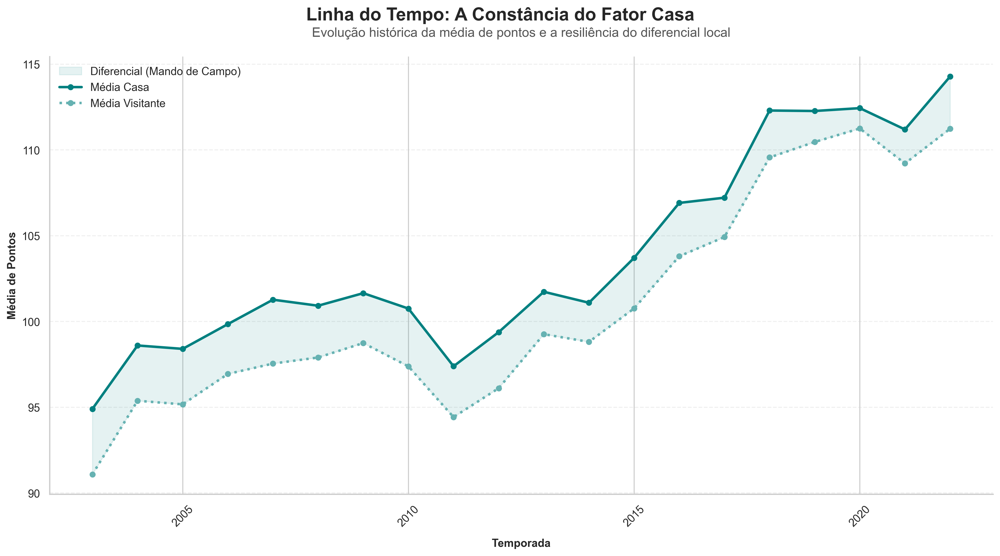
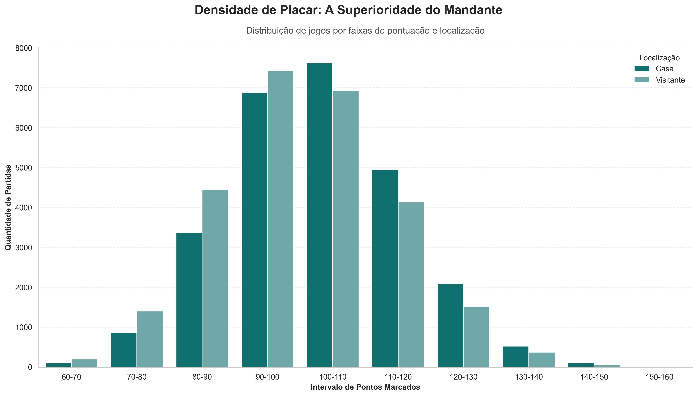
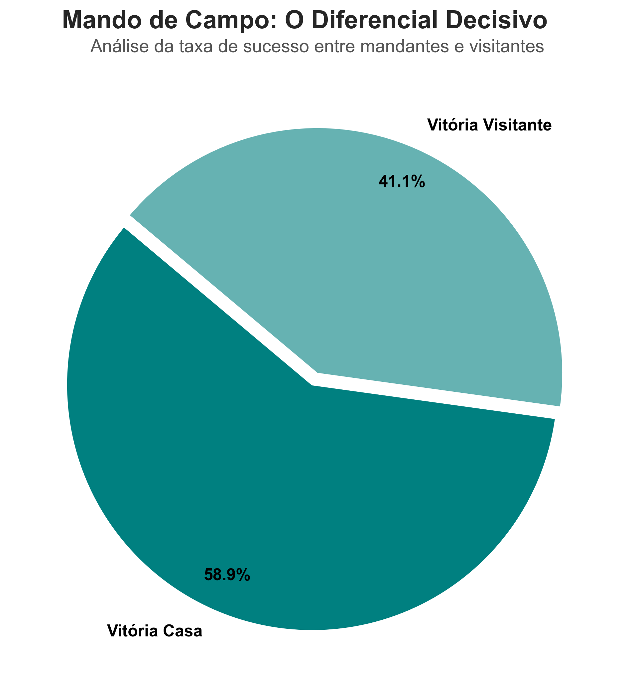
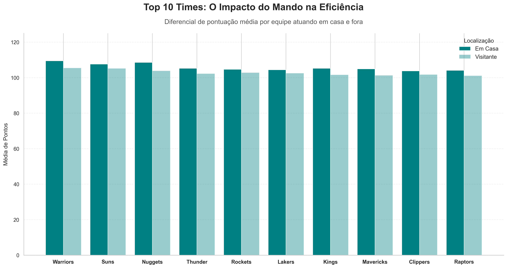

# Análise de dados da NBA

Este projeto analisa o desempenho das equipes da NBA, comparando jogos em casa e fora de casa.

O objetivo é identificar padrões de desempenho e entender o impacto do fator casa nos resultados.  

## Problema

Existe diferença significativa no desempenho das equipes jogando em casa e fora de casa?

Quais equipes são mais impactadas por esse fator?

## Dados

Foram utilizados dados de jogos da NBA contendo informações como:

- Times mandantes e visitantes
- Pontuação
- Temporada
- Resultado da partida

## Etapas do projeto

1. Coleta de dados
2. Limpeza e tratamento
3. Análise exploratória (EDA)
4. Comparação casa vs fora
5. Visualização dos dados

## Principais insights

- Times, em geral, possuem melhor desempenho jogando em casa
- Algumas equipes apresentam queda significativa fora de casa
- Outras mantêm desempenho consistente, indicando maior equilíbrio competitivo
- O fator casa pode influenciar diretamente no resultado das partidas

## 📊 Visualizações

### 🏀 Comparação Média do Fator Casa

> *Insight: Observa-se que a média de pontos das equipes jogando em casa se mantém consistentemente superior ao longo do tempo.*

### 📉 Distribuição Por Faixa de Pontuação e Localização

> *Insight: A distribuição mostra uma concentração maior em faixas de pontuação mais altas para os times mandantes.*

### ✅ Taxa de Sucesso Casa vs Fora

> *Insight: Fica evidente a vantagem do mando de quadra na taxa geral de vitórias das equipes.*

### 📈 Comparação da Pontuação de Cada Equipe

> *Insight: Análise individual do impacto do fator casa no desempenho de cada franquia da liga.*

## 🛠️ Tecnologias Utilizadas

| Tecnologia | Descrição |
| :--- | :--- |
| **Python** | Linguagem principal |
| **Pandas** | Manipulação e análise de dados |
| **Matplotlib** | Criação de gráficos |
| **Jupyter** | Ambiente de desenvolvimento |

## Integrantes:
- [Eduardo Henrique](https://github.com/EduardoHenrique15)
- [Pedro Ferraz](https://github.com/PedroFerraz87)
- [Luca Albuquerque](https://github.com/LucaAlbuquerque)
- [Ricardo Machado](https://github.com/ricardomvlins)
- [João Cláudio](https://github.com/jocla3)
- [Artur Antunes](https://github.com/artur-antunes-1)
- [George Filho](https://github.com/Georgedfilho1)
